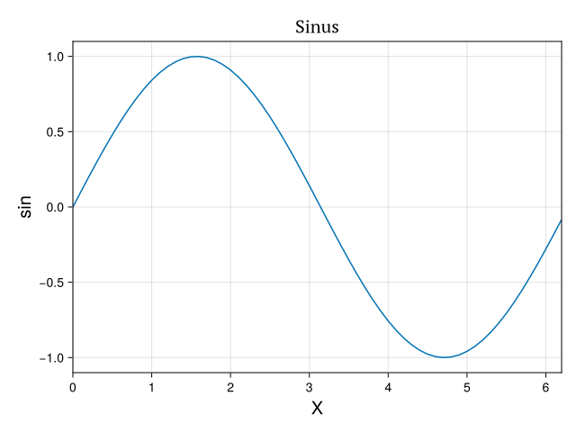
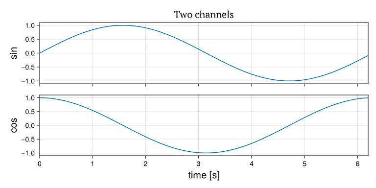
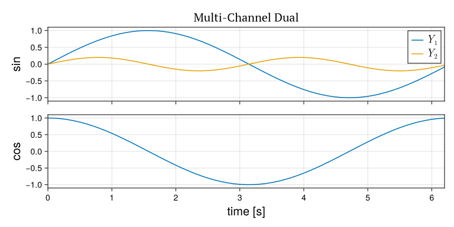
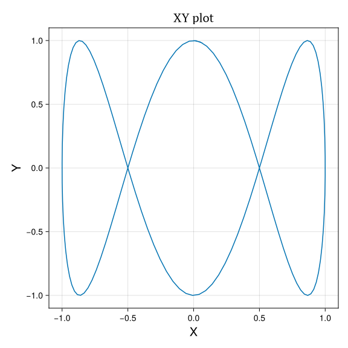
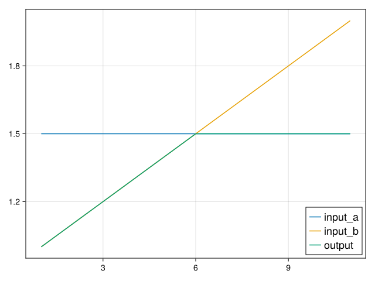
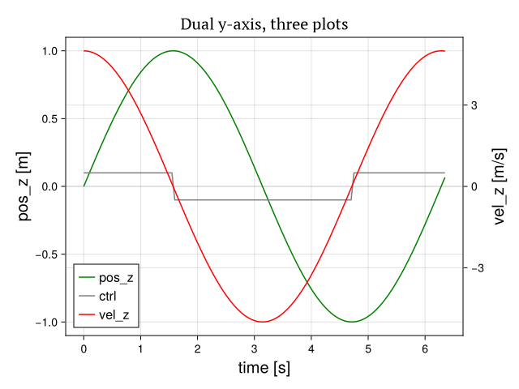
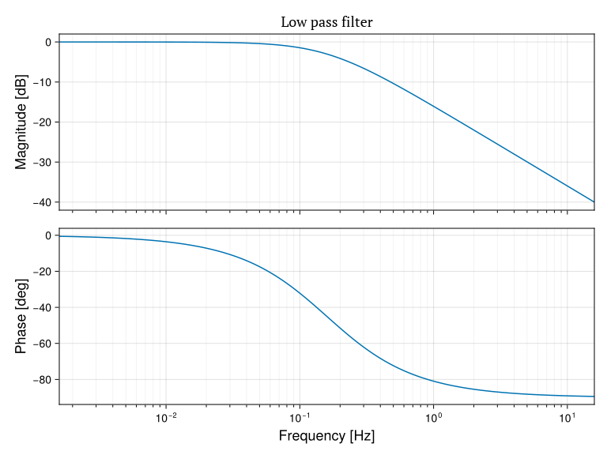

# MakieControlPlots

[](https://github.com/OpenSourceAWE/MakieControlPlots.jl/actions/workflows/CI.yml)
[](https://opensource.org/licenses/MIT)

A reimplementation of the [ControlPlots.jl](https://github.com/aenarete/ControlPlots.jl)
API on top of [Makie](https://docs.makie.org), instead of Matplotlib/PyPlot.
The function names and keyword arguments match ControlPlots, so existing
scripts keep working, but the rendering, the interactive controls
and the display model are native Makie.

Interactive windows use `GLMakie`; headless export (e.g. on CI) falls back to
`CairoMakie`. No Python or Matplotlib installation is required.

For the original API and additional background, see the
[ControlPlots.jl documentation](https://github.com/aenarete/ControlPlots.jl#readme).

## Introduction

This package provides the following features:

- simple plots can be created with the `plot()` function
- an oscilloscope-like plot with multiple channels can be created
  with the `plotx()` function
- an XY plot can be created with the `plotxy()` function
- the `plot2d` function can create fast animations of particle systems,
  connected with segments
- bode plots using the `bode_plot()` function
- pan and zoom are supported (native Makie interaction)
- LaTeX can be used for the labels
- the parameters of the plot commands are stored in a struct and returned
- this struct can be displayed again or stored in a file and loaded; the
  labels etc. can be edited and a new plot can be displayed or exported

The goal of this package is to provide simple plots for control system
developers and students.

## Installation

```julia
using Pkg
pkg"add https://github.com/aenarete/MakieControlPlots.jl"
```

## Usage

### Basic example

```julia
using MakieControlPlots, LaTeXStrings

X = 0:0.1:2pi
Y = sin.(X)
p = plot(X, Y; xlabel=L"\alpha = [0..2\pi]", ylabel="sin", fig="basic")
```

A plot window like this should pop up:

<p align="center"></p>

The package `LaTeXStrings` is only required if you want to use LaTeX for any of
your labels like in the example above. You need to prefix LaTeX strings with the
letter `L`.

You can now close the plot window.
You can re-display the plot by typing:

```julia
p
```

You can also save the plot under a name of your choice:

```julia
save("plot.jld2", p)
```

Restart Julia and load it with:

```julia
using MakieControlPlots
p = load("plot.jld2")
p
```

Full function signature:

```julia
plot(X, Y::AbstractVector{<:Number}; xlabel="", ylabel="", title="",
     xlims=nothing, ylims=nothing, ann=nothing, scatter=false,
     fig="", ysize=nothing, xsize=nothing, labelsize=20,
     output_folder="output", disp=false, new_screen=true,
     titlesize=20, legendsize=20)
```

### Multi-channel plot

```julia
using MakieControlPlots

T = 0:0.1:2pi
X = sin.(T)
Y = cos.(T)
p = plotx(T, X, Y; ylabels=["sin","cos"], fig="multi-channel", title="Two channels")
```

<p align="center"></p>

Full function signature:

```julia
plotx(X, Y...; xlabel="time [s]", ylabels=nothing, labels=nothing,
      xlims=nothing, ylims=nothing, ann=nothing, scatter=false, fig="",
      title="", ysize=nothing, xsize=nothing, labelsize=20,
      legend_position=:auto, output_folder="output", yzoom=1.0,
      disp=false, new_screen=true, legendsize=20, titlesize=20)
```

The optional parameter `ysize` can be used to change the size of the y-axis
labels. The optional parameter `yzoom` scales the vertical size of each channel.

### n x m plot

You can put more than one time series in one or more of the vertically aligned
plots. This is useful for combining set value and actual value of a signal in
one plot.

```julia
using MakieControlPlots, LaTeXStrings

T = 0:0.1:2pi
Y1 = sin.(T)
Y2 = 0.2*sin.(2T)
Y = cos.(T)
p = plotx(T, [Y1, Y2], Y; ylabels=["sin","cos"], labels=[[L"Y_1", L"Y_2"]], 
         fig="multi-channel-dual", title="Multi-Channel Dual", titlesize=20, legendsize=18)
```

<p align="center"></p>

It is sufficient to pass one or more vectors of time series to `plotx`. In this
case the labels have to be a vector of vectors.

Full function signature:

```julia
plotx(X, Y...; xlabel="time [s]", ylabels=nothing, labels=nothing,
      xlims=nothing, ylims=nothing, ann=nothing, scatter=false, fig="",
      title="", ysize=nothing, xsize=nothing, labelsize=20,
      legend_position=:auto, output_folder="output", yzoom=1.0,
      disp=false, new_screen=true, legendsize=20, titlesize=20)
```

### XY plot

```julia
using MakieControlPlots

T = 0:0.05:2pi+0.1
X = sin.(T)
Y = cos.(3T)
p = plotxy(X, Y; xlabel="X", ylabel="Y", fig="xy")
```

<p align="center"></p>

Full function signature:

```julia
plotxy(X, Y; xlabel="", ylabel="", title="", xlims=nothing,
       ylims=nothing, ann=nothing, scatter=false, fig="",
       ysize=nothing, xsize=nothing, labelsize=20,
       output_folder="output", disp=false, new_screen=true,
       titlesize=20, legendsize=20)
```

### n-in-one plot

You can plot multiple time series in one plot:

```julia
using MakieControlPlots

x   = 1.5*ones(11)
y   = 1:0.1:2
out = min.(x, y)
plot(1:11, [x, y, out]; labels=["input_a", "input_b", "output"],
     fig="2-in-one", legendsize=18)
```

<p align="center"></p>

### Dual y-axis

```julia
using MakieControlPlots

T = 0:0.05:2pi+0.1
POS_Z = sin.(T)
VEL_Z = 5*cos.(T)
CTRL = 0.1*sign.(5*cos.(T))
p=plot(T, [POS_Z, CTRL], VEL_Z; 
       xlabel="time [s]", ylabels=["pos_z [m]", "vel_z [m/s]"], legendsize=16, labels=["pos_z", "ctrl", "vel_z"],
       fig="dual-y-axis-3", title="Dual y-axis, three plots")
```

<p align="center"></p>

Full function signature:

```julia
plot(X, Y1::AbstractVector{<:AbstractVector},
     Y2::AbstractVector{<:Number};
     xlabel="", ylabels=["", ""], title="", labels=["", ""],
     xlims=nothing, ylims=nothing, ann=nothing, scatter=false,
     fig="", ysize=nothing, xsize=nothing, labelsize=20,
     legend_position=:auto, output_folder="output", disp=false,
     new_screen=true, legendsize=20, titlesize=20)
```

### Bode plot

```julia
using ControlSystemsBase
using MakieControlPlots

P = tf([1.], [1., 1])
bode_plot(P; from=-2, to=2, title="Low pass filter")
```

<p align="center"></p>

Full function signature:

```julia
bode_plot(sys::Union{StateSpace, TransferFunction}; title="", from=-1, to=1,
          fig="", db=true, hz=true, bw=false, linestyle=:solid,
          show_title=true, fontsize=18, disp=false, new_screen=true)
```

For using this function you need to do `using ControlSystemsBase` first, because
this is a package extension.

### 2D video

A video-like display of a particle system (points, connected by lines) can be
created with `plot2d`:

```julia
using MakieControlPlots

x0 = 2.0
z0 = 0.0
for t in 0:0.1:5
    global x0, z0
    plot2d([[1,0,0], [x0,0,z0]], t; segments=1, fig="plot2d")
    x0 += 0.1; z0 += 0.1
    sleep(0.1)
end
```

Full function signature:

```julia
plot2d(pos::AbstractVector, reltime::Real=0.0; zoom=true, front=false,
       segments::Integer=6, fig::String="", figsize=(6.4, 4.8),
       dpi=100, dz_zoom=1.5, dz=-5.0, dx=-16.0,
       xlim=nothing, ylim=nothing, xy=nothing, output_folder="output",
       new_screen=true, labelsize=20)

plot2d(pos::AbstractVector,
        seg::AbstractVector{<:AbstractVector{<:Integer}},
        reltime::Real=0.0; zoom=true, front=false,
        segments::Integer=6, fig::String="", figsize=(6.4, 4.8),
        dpi=100, dz_zoom=1.5, dz=1.0, dx=1.0,
        xlim=nothing, ylim=nothing, xy=nothing, output_folder="output",
        new_screen=true, labelsize=20)
```

When the function is called at `t=0` the line, dot and text objects are created.
Each time afterwards these objects are just moved/updated. Therefore the update
is very fast and you can achieve a high frame rate.

### 2D video with custom segments

You can create 2D animations with custom line segments between points:

```julia
using MakieControlPlots

for t in 0:0.05:5
    points = [
        [t, 0, 2.0],           # top
        [t-0.5, 0, 1.0],       # bottom left
        [t+0.5, 0, 1.0]        # bottom right
    ]
    segments = [
        [1, 2],  # top to bottom left
        [2, 3],  # bottom left to right
        [3, 1]   # bottom right to top
    ]
    plot2d(points, segments, t; zoom=false, xlim=(0, 5), ylim=(0, 3),
           fig="triangle")
    sleep(0.05)
end
```

The `segments` parameter defines which points should be connected by lines,
making it easy to create shapes and animations. Each segment is defined by a
pair of indices referring to points in the `points` array.

## Running the examples

The `examples/` folder contains one script per plot type, plus a menu. From the
package directory:

```julia
using Pkg
Pkg.activate("examples")
include("examples/menu.jl")
example_menu()
```

Select an example with the `<UP>`/`<DOWN>` keys and press `<ENTER>` to run it.
